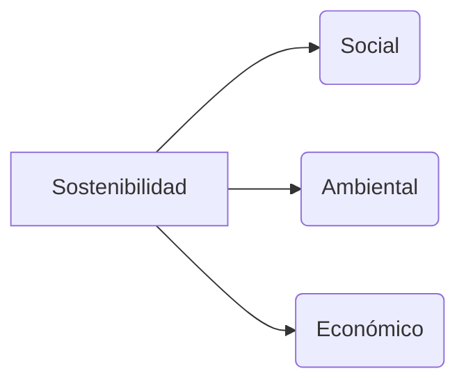

# 🌍 Concepto de sostenibilidad y marcos internacionales _(RA1.a)_

> **RA 1.a:** Describir el **concepto de sostenibilidad** y los **marcos internacionales** asociados al desarrollo sostenible.

---

## Objetivos de aprendizaje
- Presentar la **definición aceptada** de desarrollo sostenible y aclarar su relación con la **sostenibilidad**.
- Comprender las **tres dimensiones** de la sostenibilidad: ambiental, social y económica.
- Conocer los **marcos internacionales** de referencia: **Agenda 2030/ODS**, **Acuerdo de París**, **Marco de Sendai** y **Agenda de Addis Abeba**.
- Relacionar estos marcos con **decisiones sencillas** en el ámbito TIC.

---

## 1. Definiciones fundamentales

### 1.1 Desarrollo sostenible (definición clásica)
> *«Satisfacer las necesidades del presente sin comprometer la capacidad de las futuras generaciones para satisfacer sus propias necesidades»* (Informe Brundtland, 1987).

### 1.2 Sostenibilidad
La **sostenibilidad** es el **objetivo** hacia el que se orientan las decisiones para asegurar la **viabilidad a largo plazo** de un sistema (organización, servicio, comunidad), manteniendo un equilibrio entre tres dimensiones interdependientes:

- **Social (S):** bienestar, derechos, igualdad, accesibilidad y seguridad de las personas.
- **Ambiental (A):** uso responsable de recursos, emisiones, residuos y protección de ecosistemas.
- **Económica (E):** viabilidad financiera, eficiencia de costes e inversión responsable.

!!! note "Relación entre ambos conceptos"
    - **Desarrollo sostenible** describe el **proceso y los criterios** para avanzar.  
    - **Sostenibilidad** nombra el **equilibrio** que se desea alcanzar entre S–A–E.

---

## 2. Dimensiones y ejemplos en el ámbito TIC

| Dimensión | Qué abarca | Ejemplos en TIC |
|---|---|---|
| **Ambiental** | Energía, emisiones, agua, residuos (RAEE) | Optimización de código; elección de regiones *cloud* con renovables; alargar vida útil de equipos |
| **Social** | Accesibilidad, privacidad, igualdad, salud y seguridad | Web conforme a **WCAG 2.1 AA**; privacidad por defecto; diseño inclusivo |
| **Económica** | Coste total de propiedad, resiliencia, productividad | Automatización para reducir consumo; análisis coste‑eficiencia de la infraestructura |

---

## 3. Marcos internacionales de referencia

Los **marcos internacionales** proporcionan un **lenguaje común** y una **dirección** para alinear políticas y proyectos con el desarrollo sostenible. No son leyes, pero orientan objetivos, prioridades y la forma de comunicar avances.

=== "Agenda 2030 y ODS"

<iframe width="560" height="315" src="https://www.youtube.com/embed/r5v7Klr7cNs?si=bB0wyW2S9shjx5k4" title="Video ODS" frameborder="0" allow="accelerometer; autoplay; clipboard-write; encrypted-media; gyroscope; picture-in-picture; web-share" referrerpolicy="strict-origin-when-cross-origin" allowfullscreen></iframe>

**Qué es.** La **Agenda 2030** establece **17 Objetivos de Desarrollo Sostenible (ODS)** con **metas** e **indicadores**. Sirve para planificar proyectos y rendir cuentas de forma comparable.

**Propósito.** Guiar a países, organizaciones y centros educativos hacia metas medibles de bienestar social, protección ambiental y prosperidad.

**Cómo se usa.**
- Seleccionar **ODS prioritarios** para el proyecto.
- Elegir **metas** concretas y **indicadores** asociados.
- Definir **línea base** y **objetivos** (con fecha).

**ODS con conexión frecuente a TIC.** 7 (energía), 9 (industria/innovación), 10 (desigualdades), 12 (consumo responsable), 13 (clima), 16 (instituciones), 17 (alianzas).

| ODS | Enfoque | Aplicación típica en TIC |
|---|---|---|
| **7** | Energía asequible y no contaminante | Elegir *cloud* con renovables; optimizar consumo |
| **9** | Innovación e infraestructura | Monitorizar eficiencia; automatizar para reducir consumo |
| **10** | Reducción de desigualdades | Accesibilidad y diseño inclusivo |
| **12** | Producción y consumo responsables | Reducir datos servidos; reutilizar equipos |
| **13** | Acción por el clima | Estimar y disminuir consumo y emisiones del servicio |
| **16** | Instituciones sólidas | Privacidad por defecto; trazabilidad y transparencia |
| **17** | Alianzas | Contratación con cláusulas de sostenibilidad; proyectos conjuntos |

---

=== "Acuerdo de París"

<iframe width="560" height="315" src="https://www.youtube.com/embed/yE2uZHfwo8Y?si=RtYc5Wu9ZEdfayV6" title="Video Acuerdo de París" frameborder="0" allow="accelerometer; autoplay; clipboard-write; encrypted-media; gyroscope; picture-in-picture; web-share" referrerpolicy="strict-origin-when-cross-origin" allowfullscreen></iframe>

**Qué es.** Acuerdo internacional (2015) para que el **aumento de la temperatura media del planeta** (respecto a 1850–1900) **no supere los 2 °C** y, si es posible, **se quede en torno a 1,5 °C**.

**Cómo funciona.** Cada país presenta **NDC** (planes nacionales) con acciones de **mitigación** (reducir emisiones), **adaptación** (prepararse ante impactos), **financiación** y **transparencia** (medir y reportar).

**Implicación general.** En proyectos TIC: medir consumo eléctrico, reducirlo con buenas prácticas y, cuando sea posible, usar infraestructura con mayor presencia de **energía renovable**.

---

=== "Marco de Sendai"

<iframe width="560" height="315" src="https://www.youtube.com/embed/xurbWl107qM?si=wwWuEldccC7IMM2H" title="YouTube video player" frameborder="0" allow="accelerometer; autoplay; clipboard-write; encrypted-media; gyroscope; picture-in-picture; web-share" referrerpolicy="strict-origin-when-cross-origin" allowfullscreen></iframe>

**Qué es.** Marco para la **reducción del riesgo de desastres** y el aumento de la **resiliencia**.

**Propósito.** Disminuir pérdidas humanas, económicas y ambientales causadas por desastres y fallos graves.

**Aplicación en TIC.** Elaborar y probar planes de **continuidad de negocio** y **recuperación ante desastres** (copias de seguridad, redundancia, simulacros).

---

=== "Agenda de Addis Abeba"

<iframe width="560" height="315" src="https://www.youtube.com/embed/BtSVlKVYPOY?si=j9GfW8igSaP-XN2W" title="YouTube video player" frameborder="0" allow="accelerometer; autoplay; clipboard-write; encrypted-media; gyroscope; picture-in-picture; web-share" referrerpolicy="strict-origin-when-cross-origin" allowfullscreen></iframe>

**Qué es.** Agenda sobre **financiación para el desarrollo** y movilización de recursos.

**Propósito.** Alinear inversión pública y privada con objetivos de desarrollo sostenible.

**Aplicación en TIC.** Introducir **criterios de sostenibilidad** en compras y contratación; evaluar proveedores y publicar criterios de forma transparente.

!!! note "Marcos, estándares y normas"
    - **Marcos** (ODS, París, Sendai, Addis): fijan **dirección** y **lenguaje común**.  
    - **Estándares** (GRI, SASB, ESRS/CSRD, TCFD): indican **cómo medir y reportar** de forma comparable.  
    - **Normas y leyes**: establecen **obligaciones** y **sanciones**. En esta unidad se introducen los marcos; los estándares y la normativa se verán en otras sesiones.

---

### Cuadro comparativo rápido

| Marco | Objeto | Ámbito | ¿Qué pide en la práctica? | Ejemplo TIC |
|---|---|---|---|---|
| **Agenda 2030/ODS** | Metas globales de sostenibilidad | Internacional | Elegir ODS, metas e indicadores; planificar y reportar | Encajar un proyecto web en ODS 7/12/13/16 |
| **Acuerdo de París** | Acción climática | Internacional (NDC nacionales) | Medir y reducir consumo y emisiones; favorecer renovables | Revisión básica de consumo de un servicio |
| **Marco de Sendai** | Riesgo y resiliencia | Internacional (aplicación local) | Planes de continuidad y simulacros | Copias y recuperación para un servicio |
| **Agenda de Addis Abeba** | Financiación responsable | Internacional | Criterios de sostenibilidad en compras | Incluir cláusulas de sostenibilidad a proveedores |

---

## Actividad

**Objetivo.** Relacionar **medidas sencillas** en TIC con **uno de los marcos** estudiados.

**Instrucciones.** Piensa en un servicio TIC (p. ej., web del centro) y escribe **tres medidas** de mejora.  
Para cada medida, indica **qué marco** (ODS / París / Sendai / Addis) la respalda y explica en **una frase** el porqué.

| Medida concreta | Marco (ODS / París / Sendai / Addis) | Justificación en 1 frase |
|---|---|---|
| *Ej.: Comprimir imágenes y activar caché* | *ODS* | Contribuye a consumo responsable y menor uso de recursos (ODS 12). |
| | | |
| | | |
| | | |
