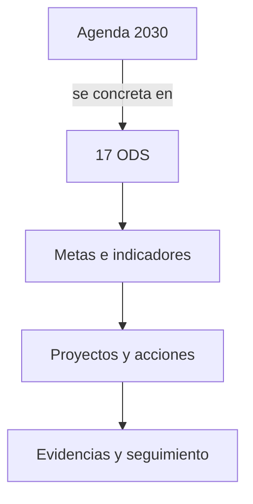

# 🌍 ODS y su relación con la Agenda 2030 _(RA1.c)_

> **RA 1.c:** Relacionar los **Objetivos de Desarrollo Sostenible (ODS)** con su **importancia para la consecución de la Agenda 2030**.

---

## Objetivos de aprendizaje
- Comprender **cómo encajan los ODS dentro de la Agenda 2030** sin repetir definiciones ya vistas en la sesión 1.
- Aplicar una **guía práctica** para mapear acciones sencillas a **ODS concretos**.
- Reconocer **principios** de la Agenda 2030 que condicionan los proyectos (universalidad, *no dejar a nadie atrás*, integración y alianzas).
- Elaborar una **matriz acción → ODS** para un caso TIC del centro.

---

## 1. Punto de partida (recordatorio breve)

<iframe width="560" height="315" src="https://www.youtube.com/embed/345IxGgjF9s?si=2Sr4Z958slnmz0WQ" title="YouTube video player" frameborder="0" allow="accelerometer; autoplay; clipboard-write; encrypted-media; gyroscope; picture-in-picture; web-share" referrerpolicy="strict-origin-when-cross-origin" allowfullscreen></iframe>

[Los 17 ODS](https://www.pactomundial.org/que-puedes-hacer-tu/ods/?gad_source=1&gad_campaignid=21296951996&gbraid=0AAAAA9e9AzhT__SKsH34jWwNtUCcWrnIA&gclid=CjwKCAjwt-_FBhBzEiwA7QEqyHLkr1-NlUXk50n6nySQsnHOaqamKT0-PDDtesSjhiBz4z-glKkX0hoCSOgQAvD_BwE){target="_blank" rel="noopener"}

- La **Agenda 2030** es el **marco común**.  
- Los **ODS (17)** operacionalizan ese marco en **áreas temáticas**, con **metas** e **indicadores**.  
- Principios: **universalidad**, **no dejar a nadie atrás**, **integración** entre objetivos y **alianzas**.

---

## 2. Cómo se conectan en la práctica (guía de 5 pasos)

1) **Definir el problema u oportunidad** del proyecto.  
2) Elegir **un ODS principal** (el que mejor describe el fin buscado).  
3) Añadir **ODS secundarios** solo si existe contribución real.  
4) Formular **metas del proyecto** (claras, medibles a tu nivel).  
5) Recoger **evidencias** del avance (antes/después, capturas, actas, etc.).

!!! warning "Evitar el «coleccionismo de iconos»"
    Asignar muchos ODS sin una contribución clara **diluye** el sentido del proyecto. Mejor **uno principal** y, si procede, **uno secundario** justificado.

---

## 3. ODS prioritarios en proyectos TIC 

| ODS | Qué persigue | Acciones típicas en TIC (ejemplos) |
|---|---|---|
| **4 Educación de calidad** | Integrar sostenibilidad en la formación | Módulos, prácticas y proyectos sobre eficiencia, accesibilidad, privacidad |
| **7 Energía asequible y no contaminante** | Reducir consumo y aumentar renovables | Optimización de servicios; elección de regiones *cloud* con mayor presencia de renovables |
| **9 Industria, innovación e infraestructura** | Innovación eficiente y resiliente | Automatización, observabilidad y mejora de arquitectura |
| **10 Reducción de desigualdades** | Inclusión y accesibilidad | Interfaces conformes con WCAG; lenguaje claro y usabilidad |
| **12 Producción y consumo responsables** | Usar menos recursos, menos residuos | Minimizar datos servidos; reutilizar y reacondicionar equipos |
| **13 Acción por el clima** | Mitigar impactos climáticos | Conectar decisiones con objetivos climáticos (p. ej., reducir consumo) |
| **16 Paz, justicia e instituciones sólidas** | Buen gobierno del dato | Privacidad por defecto, trazabilidad y comunicación transparente |
| **17 Alianzas para lograr los objetivos** | Cooperación efectiva | Acuerdos con proveedores, administración, ONG y comunidad educativa |

---

## 4. Ejemplos guiados (aplicación directa)

### 4.1 Caso: “Web del centro más ligera”
- **ODS principal:** 12 (consumo responsable).  
- **ODS secundario:** 13 (acción por el clima).  
- **Metas del proyecto:** reducir el peso medio de página y simplificar recursos innecesarios.  
- **Evidencias:** comparativa antes/después del peso de páginas y carga percibida.

### 4.2 Caso: “Aulas TIC más inclusivas”
- **ODS principal:** 10 (reducción de desigualdades).  
- **ODS secundarios:** 4 (educación de calidad), 16 (instituciones sólidas).  
- **Metas del proyecto:** adaptar interfaces a WCAG 2.1 AA en recursos docentes; usar lenguaje claro.  
- **Evidencias:** lista de pantallas revisadas, ejemplos de ajustes y validaciones realizadas.

!!! note "Coherencia entre ODS"
    Avanzar en un ODS **no debería perjudicar** a otro. Por ejemplo, añadir funciones complejas puede aumentar consumo: valorar el beneficio social y simplificar cuando sea posible.

---

## Actividad: “Mi empresa TIC con un ODS”

**Situación.** Vas a montar una **empresa de informática** (desarrollo web, soporte, apps, consultoría, etc.).  
Quieres **alinearla con la Agenda 2030** eligiendo **un ODS** y aplicándolo desde el primer día.

### 1) Elige tu ODS
Indica **nº y nombre** del ODS elegido y **por qué encaja** con tu empresa (1–2 frases).

Añade un ODS secundario, realiza lo mismo.

### 2) Plan básico (qué harás y cómo)
Rellena la tabla con **tres acciones** sencillas para los **primeros 90 días**.  
Añade **cómo** la harás (1 línea) y **una evidencia** que puedas guardar (captura, listado, política, etc.).

| Acción (90 días) | Cómo lo harás (1 línea) | Evidencia (prueba simple) |
|---|---|---|
| | | |
| | | |
| | | |

Realiza lo mismo para el ODS secundario.

### 3) Aliado y riesgo
- **Aliado clave** (persona/entidad) que te ayude a cumplirlo.  
- **Riesgo** que podría frenarte y **cómo lo evitarás** en una frase.

Realiza lo mismo para el ODS secundario.

